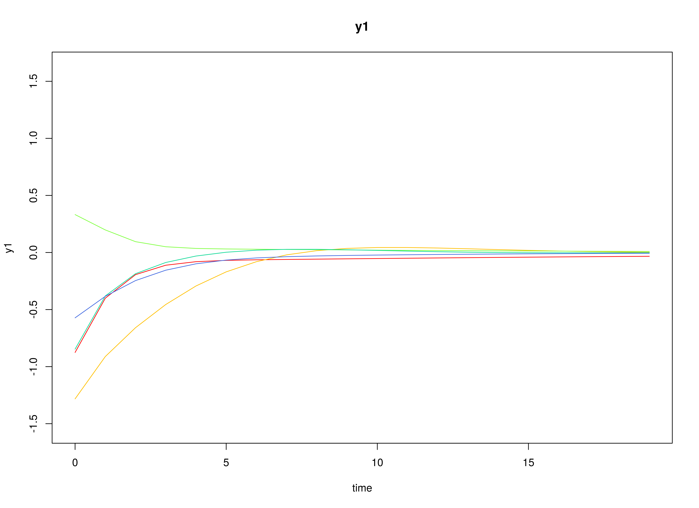

## Model

The measurement model is given by
\begin{equation}
  \mathbf{y}_{i, t}
  =
  \boldsymbol{\eta}_{i, t}
\end{equation}
where $\mathbf{y}_{i, t}$
represents a vector of observed variables
and $\boldsymbol{\eta}_{i, t}$
a vector of latent variables
for individual $i$ and time $t$.
Since the observed and latent variables are equal,
we only generate data
from the dynamic structure.

The dynamic structure is given by
\begin{equation}
  \boldsymbol{\eta}_{i, t}
  =
  \boldsymbol{\alpha}
  +
  \boldsymbol{\beta}
  \boldsymbol{\eta}_{i, t - 1}
  +
  \boldsymbol{\zeta}_{i, t},
  \quad
  \mathrm{with}
  \quad
  \boldsymbol{\zeta}_{i, t}
  \sim
  \mathcal{N}
  \left(
  \mathbf{0},
  \boldsymbol{\Psi}
  \right)
\end{equation}
where
$\boldsymbol{\eta}_{i, t}$,
$\boldsymbol{\eta}_{i, t - 1}$,
and
$\boldsymbol{\zeta}_{i, t}$
are random variables,
and
$\boldsymbol{\alpha}$,
$\boldsymbol{\beta}$,
and
$\boldsymbol{\Psi}$
are model parameters.
Here,
$\boldsymbol{\eta}_{i, t}$
is a vector of latent variables
at time $t$ and individual $i$,
$\boldsymbol{\eta}_{i, t - 1}$
represents a vector of latent variables
at time $t - 1$ and individual $i$,
and
$\boldsymbol{\zeta}_{i, t}$
represents a vector of dynamic noise
at time $t$ and individual $i$.
$\boldsymbol{\alpha}$
denotes a vector of intercepts,
$\boldsymbol{\beta}$
a matrix of autoregression
and cross regression coefficients,
and
$\boldsymbol{\Psi}$
the covariance matrix of
$\boldsymbol{\zeta}_{i, t}$.

An alternative representation of the dynamic noise
is given by
\begin{equation}
  \boldsymbol{\zeta}_{i, t}
  =
  \boldsymbol{\Psi}^{\frac{1}{2}}
  \mathbf{z}_{i, t},
  \quad
  \mathrm{with}
  \quad
  \mathbf{z}_{i, t}
  \sim
  \mathcal{N}
  \left(
  \mathbf{0},
  \mathbf{I}
  \right)
\end{equation}
where
$\left( \boldsymbol{\Psi}^{\frac{1}{2}} \right) \left( \boldsymbol{\Psi}^{\frac{1}{2}} \right)^{\prime} = \boldsymbol{\Psi}$ .

## Data Generation

### Notation

Let $t = 1000$ be the number of time points and $n = 100$ be the number of individuals.

Let the initial condition
$\boldsymbol{\eta}_{0}$
be given by

\begin{equation}
\boldsymbol{\eta}_{0} \sim \mathcal{N} \left( \boldsymbol{\mu}_{\boldsymbol{\eta} \mid 0}, \boldsymbol{\Sigma}_{\boldsymbol{\eta} \mid 0} \right)
\end{equation}

\begin{equation}
\boldsymbol{\mu}_{\boldsymbol{\eta} \mid 0}
=
\left(
\begin{array}{c}
  0 \\
  0 \\
  0 \\
\end{array}
\right)
\end{equation}

\begin{equation}
\boldsymbol{\Sigma}_{\boldsymbol{\eta} \mid 0}
=
\left(
\begin{array}{ccc}
  1 & 0 & 0 \\
  0 & 1 & 0 \\
  0 & 0 & 1 \\
\end{array}
\right) .
\end{equation}

Let the constant vector $\boldsymbol{\alpha}$ be given by

\begin{equation}
\boldsymbol{\alpha}
=
\left(
\begin{array}{c}
  0 \\
  0 \\
  0 \\
\end{array}
\right) .
\end{equation}

Let the transition matrix $\boldsymbol{\beta}$ be normally distributed with the following means

\begin{equation}
\left(
\begin{array}{ccc}
  0.7 & 0 & 0 \\
  0.5 & 0.6 & 0 \\
  -0.1 & 0.4 & 0.5 \\
\end{array}
\right)
\end{equation}

and covariance matrix

\begin{equation}
\left(
\begin{array}{ccc}
  0.01 & 0 & 0 & 0 & 0 & 0 & 0 & 0 & 0 \\
  0 & 0.01 & 0 & 0 & 0 & 0 & 0 & 0 & 0 \\
  0 & 0 & 0.01 & 0 & 0 & 0 & 0 & 0 & 0 \\
  0 & 0 & 0 & 0.01 & 0 & 0 & 0 & 0 & 0 \\
  0 & 0 & 0 & 0 & 0.01 & 0 & 0 & 0 & 0 \\
  0 & 0 & 0 & 0 & 0 & 0.01 & 0 & 0 & 0 \\
  0 & 0 & 0 & 0 & 0 & 0 & 0.01 & 0 & 0 \\
  0 & 0 & 0 & 0 & 0 & 0 & 0 & 0.01 & 0 \\
  0 & 0 & 0 & 0 & 0 & 0 & 0 & 0 & 0.01 \\
\end{array}
\right) .
\end{equation}

The SimBetaN function from the simStateSpace package generates random transition matrices from the multivariate normal distribution. Note that the function generates transition matrices that are weakly stationary.

Let the dynamic process noise $\boldsymbol{\Psi}$ be given by

\begin{equation}
\boldsymbol{\Psi}
=
\left(
\begin{array}{ccc}
  0.1 & 0 & 0 \\
  0 & 0.1 & 0 \\
  0 & 0 & 0.1 \\
\end{array}
\right) .
\end{equation}

### R Function Arguments


``` r
n
#> [1] 100
```

``` r
time
#> [1] 1000
```

``` r
mu0
#> [[1]]
#> [1] 0 0 0
```

``` r
sigma0
#>      [,1] [,2] [,3]
#> [1,]    1    0    0
#> [2,]    0    1    0
#> [3,]    0    0    1
```

``` r
sigma0_l
#> [[1]]
#>      [,1] [,2] [,3]
#> [1,]    1    0    0
#> [2,]    0    1    0
#> [3,]    0    0    1
```

``` r
alpha
#> [[1]]
#> [1] 0 0 0
```

``` r
# first beta in the list of length n
beta[[1]]
#>           [,1]       [,2]       [,3]
#> [1,] 0.6468498 0.02987347 0.09881764
#> [2,] 0.5821253 0.64048586 0.12907652
#> [3,] 0.1217450 0.33748281 0.46598132
```

``` r
psi
#>      [,1] [,2] [,3]
#> [1,]  0.1  0.0  0.0
#> [2,]  0.0  0.1  0.0
#> [3,]  0.0  0.0  0.1
```

``` r
psi_l
#> [[1]]
#>           [,1]      [,2]      [,3]
#> [1,] 0.3162278 0.0000000 0.0000000
#> [2,] 0.0000000 0.3162278 0.0000000
#> [3,] 0.0000000 0.0000000 0.3162278
```

### Visualizing the Dynamics Without Process Noise (n = 5 with Different Initial Condition)



### Using the SimSSMVARIVary Function from the simStateSpace Package to Simulate Data


``` r
library(simStateSpace)
sim <- SimSSMVARIVary(
  n = n,
  time = time,
  mu0 = mu0,
  sigma0_l = sigma0_l,
  alpha = alpha,
  beta = beta,
  psi_l = psi_l
)
data <- as.data.frame(sim)
head(data)
#>   id time          y1          y2          y3
#> 1  1    0  0.12737218 -0.28403507  0.22062143
#> 2  1    1 -0.04069348  0.05095369 -0.07975035
#> 3  1    2  0.19969250  0.55992657  0.29151437
#> 4  1    3  0.30608587  0.57340773  0.16515764
#> 5  1    4  0.44578809  0.94059304  0.46087071
#> 6  1    5  0.76944181  0.88267985  0.42186579
```

``` r
plot(sim)
```


## Model Fitting

The FitDTVARIDMx function fits a DT-VAR model on each individual $i$.


``` r
library(fitDTVARMx)
#> Loading required package: OpenMx
#> To take full advantage of multiple cores, use:
#>   mxOption(key='Number of Threads', value=parallel::detectCores()) #now
#>   Sys.setenv(OMP_NUM_THREADS=parallel::detectCores()) #before library(OpenMx)
```

``` r
fit <- FitDTVARIDMx(
  data = data,
  observed = paste0("y", seq_len(k)),
  id = "id",
  beta_start = beta_mu,
  psi_start = psi,
  psi_diag = TRUE,
  ncores = parallel::detectCores()
)
fit
#> 
#> Means of the estimated paramaters per individual.
#>      beta_11      beta_21      beta_31      beta_12      beta_22      beta_32 
#>  0.680538197  0.491146814 -0.096286416 -0.003674982  0.584713524  0.385652910 
#>      beta_13      beta_23      beta_33       psi_11       psi_22       psi_33 
#>  0.008386859 -0.011648323  0.492088875  0.099910448  0.099401607  0.099618299
```

## References


