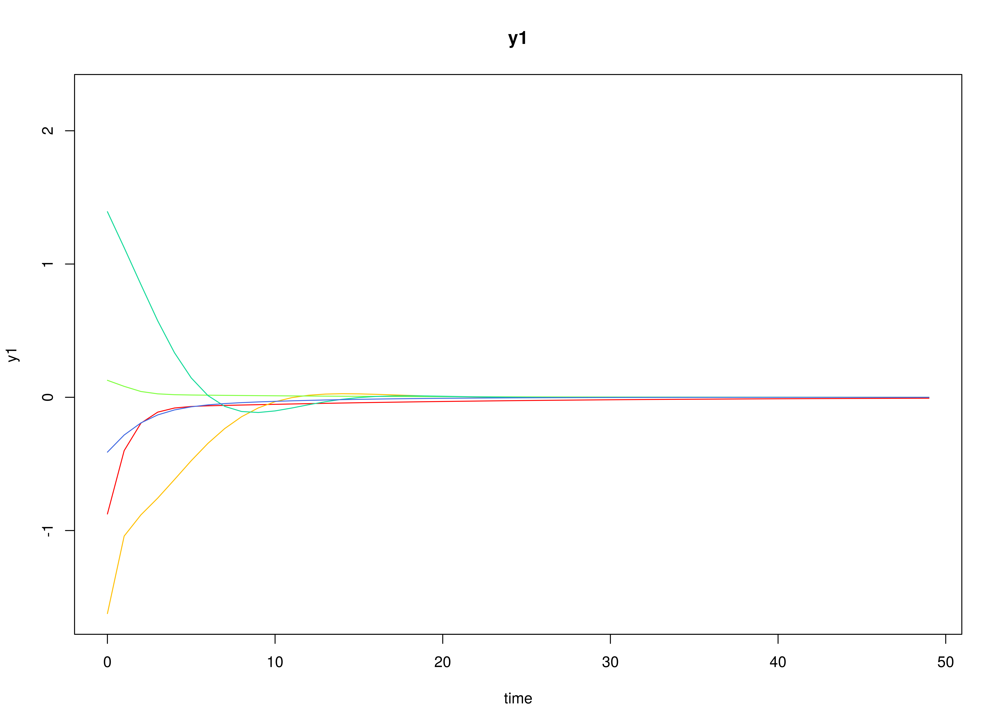

## Model

The measurement model is given by
\begin{equation}
  \mathbf{y}_{i, t}
  =
  \boldsymbol{\eta}_{i, t}
\end{equation}
where $\mathbf{y}_{i, t}$
represents a vector of observed variables
and $\boldsymbol{\eta}_{i, t}$
a vector of latent variables
for individual $i$ and time $t$.

The dynamic structure is given by
\begin{equation}
  \boldsymbol{\eta}_{i, t}
  =
  \boldsymbol{\beta}
  \boldsymbol{\eta}_{i, t - 1}
  +
  \boldsymbol{\zeta}_{i, t},
  \quad
  \mathrm{with}
  \quad
  \boldsymbol{\zeta}_{i, t}
  \sim
  \mathcal{N}
  \left(
  \mathbf{0},
  \boldsymbol{\Psi}
  \right)
\end{equation}
where
$\boldsymbol{\eta}_{i, t}$,
$\boldsymbol{\eta}_{i, t - 1}$,
and
$\boldsymbol{\zeta}_{i, t}$
are random variables,
and
$\boldsymbol{\beta}$,
and
$\boldsymbol{\Psi}$
are model parameters.
Here,
$\boldsymbol{\eta}_{i, t}$
is a vector of latent variables
at time $t$ and individual $i$,
$\boldsymbol{\eta}_{i, t - 1}$
represents a vector of latent variables
at time $t - 1$ and individual $i$,
and
$\boldsymbol{\zeta}_{i, t}$
represents a vector of dynamic noise
at time $t$ and individual $i$.
$\boldsymbol{\beta}$
denotes a matrix of autoregression
and cross regression coefficients,
and
$\boldsymbol{\Psi}$
the covariance matrix of
$\boldsymbol{\zeta}_{i, t}$.
In this model,
$\boldsymbol{\Psi}$ is a diagonal matrix.

## Data Generation

### Notation

Let $t = 1000$ be the number of time points and $n = 100$ be the number of individuals.

Let the initial condition
$\boldsymbol{\eta}_{0}$
be given by

\begin{equation}
\boldsymbol{\eta}_{0} \sim \mathcal{N} \left( \boldsymbol{\mu}_{\boldsymbol{\eta} \mid 0}, \boldsymbol{\Sigma}_{\boldsymbol{\eta} \mid 0} \right)
\end{equation}

\begin{equation}
\boldsymbol{\mu}_{\boldsymbol{\eta} \mid 0}
=
\left(
\begin{array}{c}
  0 \\
  0 \\
  0 \\
\end{array}
\right)
\end{equation}

\begin{equation}
\boldsymbol{\Sigma}_{\boldsymbol{\eta} \mid 0}
=
\left(
\begin{array}{ccc}
  1 & 0 & 0 \\
  0 & 1 & 0 \\
  0 & 0 & 1 \\
\end{array}
\right) .
\end{equation}

Let the transition matrix $\boldsymbol{\beta}$ be given by

\begin{equation}
\boldsymbol{\beta}
=
\left(
\begin{array}{ccc}
  0.7 & 0 & 0 \\
  0.5 & 0.6 & 0 \\
  -0.1 & 0.4 & 0.5 \\
\end{array}
\right) .
\end{equation}

Let the dynamic process noise $\boldsymbol{\Psi}$ be given by

\begin{equation}
\boldsymbol{\Psi}
=
\left(
\begin{array}{ccc}
  0.1 & 0 & 0 \\
  0 & 0.1 & 0 \\
  0 & 0 & 0.1 \\
\end{array}
\right) .
\end{equation}

### R Function Arguments


``` r
n
#> [1] 100
time
#> [1] 1000
mu0
#> [1] 0 0 0
sigma0
#>      [,1] [,2] [,3]
#> [1,]    1    0    0
#> [2,]    0    1    0
#> [3,]    0    0    1
sigma0_l
#>      [,1] [,2] [,3]
#> [1,]    1    0    0
#> [2,]    0    1    0
#> [3,]    0    0    1
alpha
#> [1] 0 0 0
beta
#>      [,1] [,2] [,3]
#> [1,]  0.7  0.0  0.0
#> [2,]  0.5  0.6  0.0
#> [3,] -0.1  0.4  0.5
psi
#>      [,1] [,2] [,3]
#> [1,]  0.1  0.0  0.0
#> [2,]  0.0  0.1  0.0
#> [3,]  0.0  0.0  0.1
psi_l
#>           [,1]      [,2]      [,3]
#> [1,] 0.3162278 0.0000000 0.0000000
#> [2,] 0.0000000 0.3162278 0.0000000
#> [3,] 0.0000000 0.0000000 0.3162278
```

### Visualizing the Dynamics Without Process Noise (n = 5 with Different Initial Condition)



### Using the `SimSSMVARFixed` Function from the `simStateSpace` Package to Simulate Data


``` r
library(simStateSpace)
sim <- SimSSMVARFixed(
  n = n,
  time = time,
  mu0 = mu0,
  sigma0_l = sigma0_l,
  alpha = alpha,
  beta = beta,
  psi_l = psi_l
)
data <- as.data.frame(sim)
head(data)
#>   id time          y1         y2           y3
#> 1  1    0 -0.42009090 -0.2340943  0.307329996
#> 2  1    1  0.08188521 -0.8844292  0.556177760
#> 3  1    2  0.04695228 -0.7506432  0.037108605
#> 4  1    3  0.32373035 -0.4432620 -0.382034705
#> 5  1    4 -0.14906132 -0.3897444 -0.736510205
#> 6  1    5 -0.38126798 -0.2523750  0.005946284
plot(sim)
```


## Model Fitting

The `DTVAR` function fits a DT-VAR model assuming fixed parameters using the `byid = FALSE` argument.


``` r
library(fitDTVARMx)
DTVAR(
  data = data,
  observed = paste0("y", seq_len(k)),
  id = "id",
  model = 1,
  byid = FALSE,
  ncores = parallel::detectCores()
)
#> Running DTVAR with 12 parameters
#> 
#> Beginning initial fit attempt
#> Running DTVAR with 12 parameters
#> 
#>  Lowest minimum so far:  161039.811694934
#> 
#> Solution found
```



```
#> 
#>  Solution found!  Final fit=161039.81 (started at 557941.17)  (1 attempt(s): 1 valid, 0 errors)
#>  Start values from best fit:
#> 0.698246492812554,0.498583301246745,-0.101115903036828,-0.000998116359015136,0.602045350258964,0.401558877647742,0.00479802020531404,-0.00378028100285481,0.499300186783842,0.100179544689319,0.0996669845545017,0.0998790044443722
#> Summary of DTVAR 
#>  
#> free parameters:
#>       name       matrix  row  col      Estimate    Std.Error A
#> 1  beta_11 DTVAR_1.beta eta1 eta1  0.6982464928 0.0025391568  
#> 2  beta_21 DTVAR_1.beta eta2 eta1  0.4985833012 0.0025372039  
#> 3  beta_31 DTVAR_1.beta eta3 eta1 -0.1011159030 0.0025405888  
#> 4  beta_12 DTVAR_1.beta eta1 eta2 -0.0009981164 0.0021375422  
#> 5  beta_22 DTVAR_1.beta eta2 eta2  0.6020453503 0.0021333402  
#> 6  beta_32 DTVAR_1.beta eta3 eta2  0.4015588776 0.0021398312  
#> 7  beta_13 DTVAR_1.beta eta1 eta3  0.0047980202 0.0021807234  
#> 8  beta_23 DTVAR_1.beta eta2 eta3 -0.0037802810 0.0021747033  
#> 9  beta_33 DTVAR_1.beta eta3 eta3  0.4993001868 0.0021767150  
#> 10  psi_11  DTVAR_1.psi eta1 eta1  0.1001795447 0.0004484372  
#> 11  psi_22  DTVAR_1.psi eta2 eta2  0.0996669846 0.0004461657  
#> 12  psi_33  DTVAR_1.psi eta3 eta3  0.0998790044 0.0004471070  
#>                  lbound ubound
#> 1                             
#> 2                             
#> 3                             
#> 4                             
#> 5                             
#> 6                             
#> 7                             
#> 8                             
#> 9                             
#> 10 2.2250738585072e-308       
#> 11 2.2250738585072e-308       
#> 12 2.2250738585072e-308       
#> 
#> Model Statistics: 
#>                |  Parameters  |  Degrees of Freedom  |  Fit (-2lnL units)
#>        Model:             12                 299988              161039.8
#>    Saturated:             NA                     NA                    NA
#> Independence:             NA                     NA                    NA
#> Number of observations/statistics: 1e+05/3e+05
#> 
#> Information Criteria: 
#>       |  df Penalty  |  Parameters Penalty  |  Sample-Size Adjusted
#> AIC:      -438936.2               161063.8                 161063.8
#> BIC:     -3292699.7               161178.0                 161139.8
#> CFI: NA 
#> TLI: 1   (also known as NNFI) 
#> RMSEA:  0  [95% CI (NA, NA)]
#> Prob(RMSEA <= 0.05): NA
#> To get additional fit indices, see help(mxRefModels)
#> timestamp: 2024-09-21 21:21:52 
#> Wall clock time: 144.0279 secs 
#> optimizer:  SLSQP 
#> OpenMx version number: 2.21.12 
#> Need help?  See help(mxSummary)
```

## References


