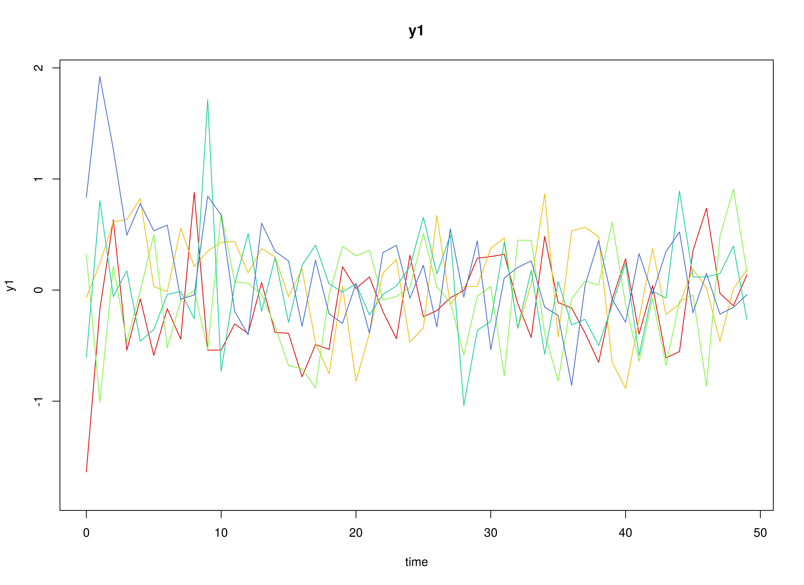

## Model

The measurement model is given by
\begin{equation}
  \mathbf{y}_{i, t}
  =
  \boldsymbol{\Lambda}
  \boldsymbol{\eta}_{i, t}
  +
  \boldsymbol{\varepsilon}_{i, t},
  \quad
  \mathrm{with}
  \quad
  \boldsymbol{\varepsilon}_{i, t}
  \sim
  \mathcal{N}
  \left(
  \mathbf{0},
  \boldsymbol{\Theta}
  \right)
\end{equation}
where
$\mathbf{y}_{i, t}$,
$\boldsymbol{\eta}_{i, t}$,
and
$\boldsymbol{\varepsilon}_{i, t}$
are random variables
and
$\boldsymbol{\Lambda}$,
and
$\boldsymbol{\Theta}$
are model parameters.
$\mathbf{y}_{i, t}$
represents a vector of observed random variables,
$\boldsymbol{\eta}_{i, t}$
a vector of latent random variables,
and
$\boldsymbol{\varepsilon}_{i, t}$
a vector of random measurement errors,
at time $t$ and individual $i$.
$\boldsymbol{\Lambda}$
denotes a matrix of factor loadings,
and
$\boldsymbol{\Theta}$
the covariance matrix of
$\boldsymbol{\varepsilon}$.
In this model,
$\boldsymbol{\Lambda}$ is an identity matrix and
$\boldsymbol{\Theta}$ is a diagonal matrix.

The dynamic structure is given by
\begin{equation}
  \boldsymbol{\eta}_{i, t}
  =
  \boldsymbol{\alpha}
  +
  \boldsymbol{\beta}
  \boldsymbol{\eta}_{i, t - 1}
  +
  \boldsymbol{\zeta}_{i, t},
  \quad
  \mathrm{with}
  \quad
  \boldsymbol{\zeta}_{i, t}
  \sim
  \mathcal{N}
  \left(
  \mathbf{0},
  \boldsymbol{\Psi}
  \right)
\end{equation}
where
$\boldsymbol{\eta}_{i, t}$,
$\boldsymbol{\eta}_{i, t - 1}$,
and
$\boldsymbol{\zeta}_{i, t}$
are random variables,
and
$\boldsymbol{\alpha}$,
$\boldsymbol{\beta}$,
and
$\boldsymbol{\Psi}$
are model parameters.
Here,
$\boldsymbol{\eta}_{i, t}$
is a vector of latent variables
at time $t$ and individual $i$,
$\boldsymbol{\eta}_{i, t - 1}$
represents a vector of latent variables
at time $t - 1$ and individual $i$,
and
$\boldsymbol{\zeta}_{i, t}$
represents a vector of dynamic noise
at time $t$ and individual $i$.
$\boldsymbol{\alpha}$
denotes a vector of intercepts,
$\boldsymbol{\beta}$
a matrix of autoregression
and cross regression coefficients,
and
$\boldsymbol{\Psi}$
the covariance matrix of
$\boldsymbol{\zeta}_{i, t}$.
In this model,
$\boldsymbol{\Psi}$ is a symmetric matrix.

## Data Generation

### Notation

Let $t = 1000$ be the number of time points and $n = 100$ be the number of individuals.

Let the measurement model intecept vector $\boldsymbol{\nu}$ be given by

\begin{equation}
\boldsymbol{\nu}
=
\left(
\begin{array}{c}
  0 \\
  0 \\
  0 \\
\end{array}
\right) .
\end{equation}

Let the factor loadings matrix $\boldsymbol{\Lambda}$ be given by

\begin{equation}
\boldsymbol{\Lambda}
=
\left(
\begin{array}{ccc}
  1 & 0 & 0 \\
  0 & 1 & 0 \\
  0 & 0 & 1 \\
\end{array}
\right) .
\end{equation}

Let the measurement error covariance matrix $\boldsymbol{\Theta}$ be given by

\begin{equation}
\boldsymbol{\Theta}
=
\left(
\begin{array}{ccc}
  0.2 & 0 & 0 \\
  0 & 0.2 & 0 \\
  0 & 0 & 0.2 \\
\end{array}
\right) .
\end{equation}

Let the initial condition
$\boldsymbol{\eta}_{0}$
be given by

\begin{equation}
\boldsymbol{\eta}_{0} \sim \mathcal{N} \left( \boldsymbol{\mu}_{\boldsymbol{\eta} \mid 0}, \boldsymbol{\Sigma}_{\boldsymbol{\eta} \mid 0} \right)
\end{equation}

\begin{equation}
\boldsymbol{\mu}_{\boldsymbol{\eta} \mid 0}
=
\left(
\begin{array}{c}
  0 \\
  0 \\
  0 \\
\end{array}
\right)
\end{equation}

\begin{equation}
\boldsymbol{\Sigma}_{\boldsymbol{\eta} \mid 0}
=
\left(
\begin{array}{ccc}
  1 & 0 & 0 \\
  0 & 1 & 0 \\
  0 & 0 & 1 \\
\end{array}
\right) .
\end{equation}

Let the transition matrix $\boldsymbol{\beta}$ be given by

\begin{equation}
\left(
\begin{array}{ccc}
  0.7 & 0 & 0 \\
  0.5 & 0.6 & 0 \\
  -0.1 & 0.4 & 0.5 \\
\end{array}
\right) .
\end{equation}

Let the dynamic process noise $\boldsymbol{\Psi}$ be given by

\begin{equation}
\boldsymbol{\Psi}
=
\left(
\begin{array}{ccc}
  0.1 & 0 & 0 \\
  0 & 0.1 & 0 \\
  0 & 0 & 0.1 \\
\end{array}
\right) .
\end{equation}

### R Function Arguments


``` r
n
#> [1] 100
time
#> [1] 1000
mu0
#> [1] 0 0 0
sigma0
#>      [,1] [,2] [,3]
#> [1,]    1    0    0
#> [2,]    0    1    0
#> [3,]    0    0    1
sigma0_l
#>      [,1] [,2] [,3]
#> [1,]    1    0    0
#> [2,]    0    1    0
#> [3,]    0    0    1
alpha
#> [1] 0 0 0
beta
#>      [,1] [,2] [,3]
#> [1,]  0.7  0.0  0.0
#> [2,]  0.5  0.6  0.0
#> [3,] -0.1  0.4  0.5
psi
#>      [,1] [,2] [,3]
#> [1,]  0.1  0.0  0.0
#> [2,]  0.0  0.1  0.0
#> [3,]  0.0  0.0  0.1
psi_l
#>           [,1]      [,2]      [,3]
#> [1,] 0.3162278 0.0000000 0.0000000
#> [2,] 0.0000000 0.3162278 0.0000000
#> [3,] 0.0000000 0.0000000 0.3162278
nu
#> [1] 0 0 0
lambda
#>      [,1] [,2] [,3]
#> [1,]    1    0    0
#> [2,]    0    1    0
#> [3,]    0    0    1
theta
#>      [,1] [,2] [,3]
#> [1,]  0.2  0.0  0.0
#> [2,]  0.0  0.2  0.0
#> [3,]  0.0  0.0  0.2
```

### Visualizing the Dynamics Without Process Noise (n = 5 with Different Initial Condition)



### Using the `SimSSMFixed` Function from the `simStateSpace` Package to Simulate Data


``` r
library(simStateSpace)
sim <- SimSSMFixed(
  n = n,
  time = time,
  mu0 = mu0,
  sigma0_l = sigma0_l,
  alpha = alpha,
  beta = beta,
  psi_l = psi_l,
  nu = nu,
  lambda = lambda,
  theta_l = theta_l
)
data <- as.data.frame(sim)
head(data)
#>   id time          y1         y2         y3
#> 1  1    0 -0.36389392  0.2260508 -1.0840920
#> 2  1    1 -0.17839821 -0.4923748 -0.2933503
#> 3  1    2 -0.29837320 -0.5441213  0.1678981
#> 4  1    3  0.06914180 -1.5266350 -0.7623779
#> 5  1    4  0.55603569 -0.8676678  0.1421071
#> 6  1    5  0.01185309 -0.4340968 -0.7695032
plot(sim)
```


## Model Fitting

The `DTVAR` function fits a DT-VAR model assuming fixed parameters using the `byid = FALSE` argument.


``` r
library(fitDTVARMx)
DTVAR(
  data = data,
  observed = paste0("y", seq_len(k)),
  id = "id",
  model = 4,
  byid = FALSE,
  ncores = parallel::detectCores()
)
#> Running DTVAR with 21 parameters
#> 
#> Beginning initial fit attempt
#> Running DTVAR with 21 parameters
#> 
#>  Lowest minimum so far:  531295.653479004
#> 
#> Solution found
```



```
#> 
#>  Solution found!  Final fit=531295.65 (started at 744579.25)  (1 attempt(s): 1 valid, 0 errors)
#>  Start values from best fit:
#> 0.715091587415828,0.502971911184131,-0.0995693177643821,-0.00548531069432135,0.598052081503045,0.392379533140929,0.00415383853044094,-0.00158317414979697,0.507281439932869,0.000139346711352536,0.000278857728749898,0.00145505592600506,0.0951331459072247,6.63918210337825e-05,0.102477838166725,-0.000265928850043793,0.000174981070006773,0.0962505920297543,0.202322856550589,0.198757693127683,0.204637123110189
#> Summary of DTVAR 
#>  
#> free parameters:
#>        name        matrix  row  col      Estimate   Std.Error A
#> 1   beta_11  DTVAR_1.beta eta1 eta1  7.150916e-01 0.009127770  
#> 2   beta_21  DTVAR_1.beta eta2 eta1  5.029719e-01 0.009951204  
#> 3   beta_31  DTVAR_1.beta eta3 eta1 -9.956932e-02 0.007279707  
#> 4   beta_12  DTVAR_1.beta eta1 eta2 -5.485311e-03 0.005739088  
#> 5   beta_22  DTVAR_1.beta eta2 eta2  5.980521e-01 0.007748275  
#> 6   beta_32  DTVAR_1.beta eta3 eta2  3.923795e-01 0.007040035  
#> 7   beta_13  DTVAR_1.beta eta1 eta3  4.153839e-03 0.004307841  
#> 8   beta_23  DTVAR_1.beta eta2 eta3 -1.583174e-03 0.005573564  
#> 9   beta_33  DTVAR_1.beta eta3 eta3  5.072814e-01 0.006741335  
#> 10  alpha_1 DTVAR_1.gamma    1    1  1.393467e-04 0.001057231  
#> 11  alpha_2 DTVAR_1.gamma    2    1  2.788577e-04 0.001363886  
#> 12  alpha_3 DTVAR_1.gamma    3    1  1.455056e-03 0.001337205  
#> 13   psi_11   DTVAR_1.psi eta1 eta1  9.513315e-02 0.002887090  
#> 14   psi_21   DTVAR_1.psi eta1 eta2  6.639182e-05 0.001095626  
#> 15   psi_22   DTVAR_1.psi eta2 eta2  1.024778e-01 0.002546623  
#> 16   psi_31   DTVAR_1.psi eta1 eta3 -2.659289e-04 0.001020360  
#> 17   psi_32   DTVAR_1.psi eta2 eta3  1.749811e-04 0.001046401  
#> 18   psi_33   DTVAR_1.psi eta3 eta3  9.625059e-02 0.002928465  
#> 19 theta_11 DTVAR_1.theta   y1   y1  2.023229e-01 0.002465347  
#> 20 theta_22 DTVAR_1.theta   y2   y2  1.987577e-01 0.002492984  
#> 21 theta_33 DTVAR_1.theta   y3   y3  2.046371e-01 0.002974318  
#>                  lbound ubound
#> 1                             
#> 2                             
#> 3                             
#> 4                             
#> 5                             
#> 6                             
#> 7                             
#> 8                             
#> 9                             
#> 10                            
#> 11                            
#> 12                            
#> 13 2.2250738585072e-308       
#> 14                            
#> 15 2.2250738585072e-308       
#> 16                            
#> 17                            
#> 18 2.2250738585072e-308       
#> 19 2.2250738585072e-308       
#> 20 2.2250738585072e-308       
#> 21 2.2250738585072e-308       
#> 
#> Model Statistics: 
#>                |  Parameters  |  Degrees of Freedom  |  Fit (-2lnL units)
#>        Model:             21                 299979              531295.7
#>    Saturated:             NA                     NA                    NA
#> Independence:             NA                     NA                    NA
#> Number of observations/statistics: 1e+05/3e+05
#> 
#> Information Criteria: 
#>       |  df Penalty  |  Parameters Penalty  |  Sample-Size Adjusted
#> AIC:      -68662.35               531337.7                 531337.7
#> BIC:    -2922340.21               531537.4                 531470.7
#> CFI: NA 
#> TLI: 1   (also known as NNFI) 
#> RMSEA:  0  [95% CI (NA, NA)]
#> Prob(RMSEA <= 0.05): NA
#> To get additional fit indices, see help(mxRefModels)
#> timestamp: 2024-08-25 19:32:49 
#> Wall clock time: 131.148 secs 
#> optimizer:  SLSQP 
#> OpenMx version number: 2.21.12 
#> Need help?  See help(mxSummary)
```

## References


