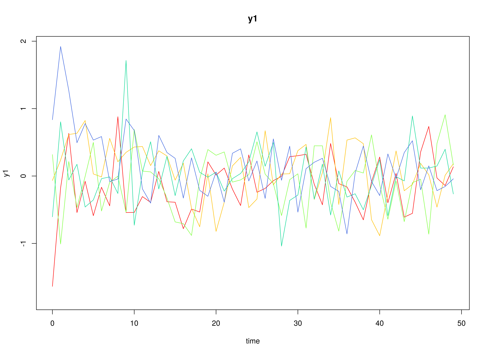
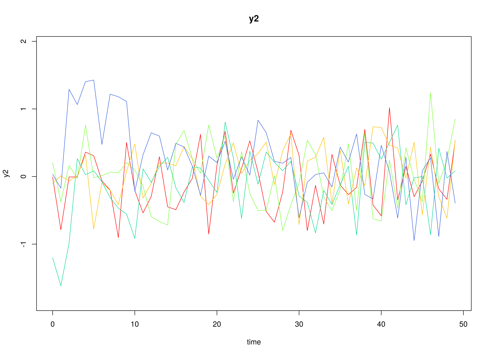
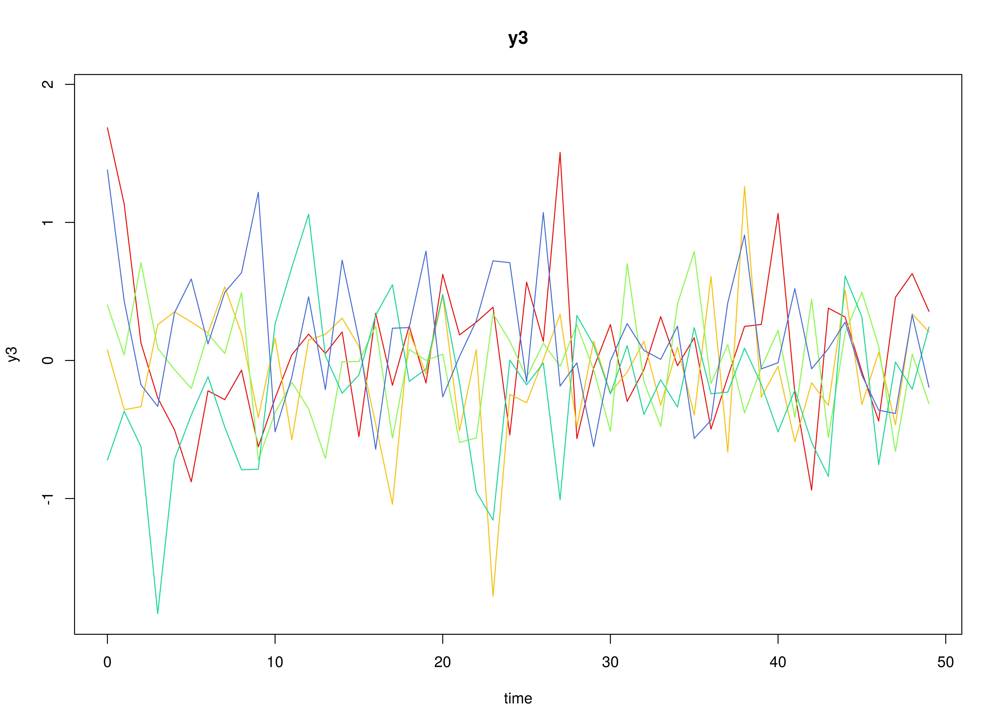

## Model

The measurement model is given by
\begin{equation}
  \mathbf{y}_{i, t}
  =
  \boldsymbol{\Lambda}
  \boldsymbol{\eta}_{i, t}
  +
  \boldsymbol{\varepsilon}_{i, t},
  \quad
  \mathrm{with}
  \quad
  \boldsymbol{\varepsilon}_{i, t}
  \sim
  \mathcal{N}
  \left(
  \mathbf{0},
  \boldsymbol{\Theta}
  \right)
\end{equation}
where
$\mathbf{y}_{i, t}$,
$\boldsymbol{\eta}_{i, t}$,
and
$\boldsymbol{\varepsilon}_{i, t}$
are random variables
and
$\boldsymbol{\Lambda}$,
and
$\boldsymbol{\Theta}$
are model parameters.
$\mathbf{y}_{i, t}$
represents a vector of observed random variables,
$\boldsymbol{\eta}_{i, t}$
a vector of latent random variables,
and
$\boldsymbol{\varepsilon}_{i, t}$
a vector of random measurement errors,
at time $t$ and individual $i$.
$\boldsymbol{\Lambda}$
denotes a matrix of factor loadings,
and
$\boldsymbol{\Theta}$
the covariance matrix of
$\boldsymbol{\varepsilon}$.
In this model,
$\boldsymbol{\Lambda}$ is an identity matrix and
$\boldsymbol{\Theta}$ is a diagonal matrix.

The dynamic structure is given by
\begin{equation}
  \boldsymbol{\eta}_{i, t}
  =
  \boldsymbol{\alpha}
  +
  \boldsymbol{\beta}
  \boldsymbol{\eta}_{i, t - 1}
  +
  \boldsymbol{\zeta}_{i, t},
  \quad
  \mathrm{with}
  \quad
  \boldsymbol{\zeta}_{i, t}
  \sim
  \mathcal{N}
  \left(
  \mathbf{0},
  \boldsymbol{\Psi}
  \right)
\end{equation}
where
$\boldsymbol{\eta}_{i, t}$,
$\boldsymbol{\eta}_{i, t - 1}$,
and
$\boldsymbol{\zeta}_{i, t}$
are random variables,
and
$\boldsymbol{\alpha}$,
$\boldsymbol{\beta}$,
and
$\boldsymbol{\Psi}$
are model parameters.
Here,
$\boldsymbol{\eta}_{i, t}$
is a vector of latent variables
at time $t$ and individual $i$,
$\boldsymbol{\eta}_{i, t - 1}$
represents a vector of latent variables
at time $t - 1$ and individual $i$,
and
$\boldsymbol{\zeta}_{i, t}$
represents a vector of dynamic noise
at time $t$ and individual $i$.
$\boldsymbol{\alpha}$
denotes a vector of intercepts,
$\boldsymbol{\beta}$
a matrix of autoregression
and cross regression coefficients,
and
$\boldsymbol{\Psi}$
the covariance matrix of
$\boldsymbol{\zeta}_{i, t}$.
In this model,
$\boldsymbol{\Psi}$ is a symmetric matrix.

## Data Generation

### Notation

Let $t = 1000$ be the number of time points and $n = 100$ be the number of individuals.

Let the measurement model intecept vector $\boldsymbol{\nu}$ be given by

\begin{equation}
\boldsymbol{\nu}
=
\left(
\begin{array}{c}
  0 \\
  0 \\
  0 \\
\end{array}
\right) .
\end{equation}

Let the factor loadings matrix $\boldsymbol{\Lambda}$ be given by

\begin{equation}
\boldsymbol{\Lambda}
=
\left(
\begin{array}{ccc}
  1 & 0 & 0 \\
  0 & 1 & 0 \\
  0 & 0 & 1 \\
\end{array}
\right) .
\end{equation}

Let the measurement error covariance matrix $\boldsymbol{\Theta}$ be given by

\begin{equation}
\boldsymbol{\Theta}
=
\left(
\begin{array}{ccc}
  0.2 & 0 & 0 \\
  0 & 0.2 & 0 \\
  0 & 0 & 0.2 \\
\end{array}
\right) .
\end{equation}

Let the initial condition
$\boldsymbol{\eta}_{0}$
be given by

\begin{equation}
\boldsymbol{\eta}_{0} \sim \mathcal{N} \left( \boldsymbol{\mu}_{\boldsymbol{\eta} \mid 0}, \boldsymbol{\Sigma}_{\boldsymbol{\eta} \mid 0} \right)
\end{equation}

\begin{equation}
\boldsymbol{\mu}_{\boldsymbol{\eta} \mid 0}
=
\left(
\begin{array}{c}
  0 \\
  0 \\
  0 \\
\end{array}
\right)
\end{equation}

\begin{equation}
\boldsymbol{\Sigma}_{\boldsymbol{\eta} \mid 0}
=
\left(
\begin{array}{ccc}
  1 & 0 & 0 \\
  0 & 1 & 0 \\
  0 & 0 & 1 \\
\end{array}
\right) .
\end{equation}

Let the transition matrix $\boldsymbol{\beta}$ be normally distributed with the following means

\begin{equation}
\left(
\begin{array}{ccc}
  0.7 & 0 & 0 \\
  0.5 & 0.6 & 0 \\
  -0.1 & 0.4 & 0.5 \\
\end{array}
\right)
\end{equation}

and covariance matrix

\begin{equation}
\left(
\begin{array}{ccc}
  0.01 & 0 & 0 & 0 & 0 & 0 & 0 & 0 & 0 \\
  0 & 0.01 & 0 & 0 & 0 & 0 & 0 & 0 & 0 \\
  0 & 0 & 0.01 & 0 & 0 & 0 & 0 & 0 & 0 \\
  0 & 0 & 0 & 0.01 & 0 & 0 & 0 & 0 & 0 \\
  0 & 0 & 0 & 0 & 0.01 & 0 & 0 & 0 & 0 \\
  0 & 0 & 0 & 0 & 0 & 0.01 & 0 & 0 & 0 \\
  0 & 0 & 0 & 0 & 0 & 0 & 0.01 & 0 & 0 \\
  0 & 0 & 0 & 0 & 0 & 0 & 0 & 0.01 & 0 \\
  0 & 0 & 0 & 0 & 0 & 0 & 0 & 0 & 0.01 \\
\end{array}
\right) .
\end{equation}

The `SimBetaN` function from the `simStateSpace` package generates random transition matrices from the multivariate normal distribution. Note that the function generates transition matrices that are weakly stationary.

Let the dynamic process noise $\boldsymbol{\Psi}$ be given by

\begin{equation}
\boldsymbol{\Psi}
=
\left(
\begin{array}{ccc}
  0.1 & 0 & 0 \\
  0 & 0.1 & 0 \\
  0 & 0 & 0.1 \\
\end{array}
\right) .
\end{equation}

### R Function Arguments


``` r
n
#> [1] 100
time
#> [1] 1000
mu0
#> [[1]]
#> [1] 0 0 0
sigma0
#>      [,1] [,2] [,3]
#> [1,]    1    0    0
#> [2,]    0    1    0
#> [3,]    0    0    1
sigma0_l
#> [[1]]
#>      [,1] [,2] [,3]
#> [1,]    1    0    0
#> [2,]    0    1    0
#> [3,]    0    0    1
alpha
#> [[1]]
#> [1] 0 0 0
# first beta in the list of length n
beta[[1]]
#>           [,1]       [,2]       [,3]
#> [1,] 0.6468498 0.02987347 0.09881764
#> [2,] 0.5821253 0.64048586 0.12907652
#> [3,] 0.1217450 0.33748281 0.46598132
psi
#>      [,1] [,2] [,3]
#> [1,]  0.1  0.0  0.0
#> [2,]  0.0  0.1  0.0
#> [3,]  0.0  0.0  0.1
psi_l
#> [[1]]
#>           [,1]      [,2]      [,3]
#> [1,] 0.3162278 0.0000000 0.0000000
#> [2,] 0.0000000 0.3162278 0.0000000
#> [3,] 0.0000000 0.0000000 0.3162278
nu
#> [[1]]
#> [1] 0 0 0
lambda
#> [[1]]
#>      [,1] [,2] [,3]
#> [1,]    1    0    0
#> [2,]    0    1    0
#> [3,]    0    0    1
theta
#>      [,1] [,2] [,3]
#> [1,]  0.2  0.0  0.0
#> [2,]  0.0  0.2  0.0
#> [3,]  0.0  0.0  0.2
```

### Visualizing the Dynamics Without Process Noise (n = 5 with Different Initial Condition)



### Using the `SimSSMIVary` Function from the `simStateSpace` Package to Simulate Data


``` r
library(simStateSpace)
sim <- SimSSMIVary(
  n = n,
  time = time,
  mu0 = mu0,
  sigma0_l = sigma0_l,
  alpha = alpha,
  beta = beta,
  psi_l = psi_l,
  nu = nu,
  lambda = lambda,
  theta_l = theta_l
)
data <- as.data.frame(sim)
head(data)
#>   id time          y1         y2          y3
#> 1  1    0 -0.63437294  0.6021365 -0.91776552
#> 2  1    1 -0.81485487  0.3819811  0.68347267
#> 3  1    2 -0.74662080  0.1263441  0.85777810
#> 4  1    3 -0.50939822 -0.3310262  0.82453806
#> 5  1    4 -0.03333068 -0.4789725 -0.09547539
#> 6  1    5  0.82744597 -0.1903433  1.01685273
plot(sim)
```


## Model Fitting

The `DTVAR` function fits a DT-VAR model on each individual $i$ using the `byid = TRUE` argument.


``` r
library(fitDTVARMx)
DTVAR(
  data = data,
  observed = paste0("y", seq_len(k)),
  id = "id",
  model = 4,
  byid = TRUE,
  ncores = parallel::detectCores()
)
#> 
#> Means of the estimated paramaters per individual.
#>       beta_11       beta_21       beta_31       beta_12       beta_22 
#>  6.547278e-01  4.727890e-01 -9.903457e-02  2.619119e-02  6.092642e-01 
#>       beta_32       beta_13       beta_23       beta_33       alpha_1 
#>  3.930405e-01 -1.021134e-02 -2.623697e-02  4.933279e-01  1.272316e-03 
#>       alpha_2       alpha_3        psi_11        psi_21        psi_22 
#>  2.105038e-03  2.195758e-03  9.849836e-02  1.676669e-03  9.745999e-02 
#>        psi_31        psi_32        psi_33      theta_11      theta_22 
#>  5.546903e-04 -9.517665e-05  1.014263e-01  2.011655e-01  2.030307e-01 
#>      theta_33 
#>  1.954174e-01
```

## References


